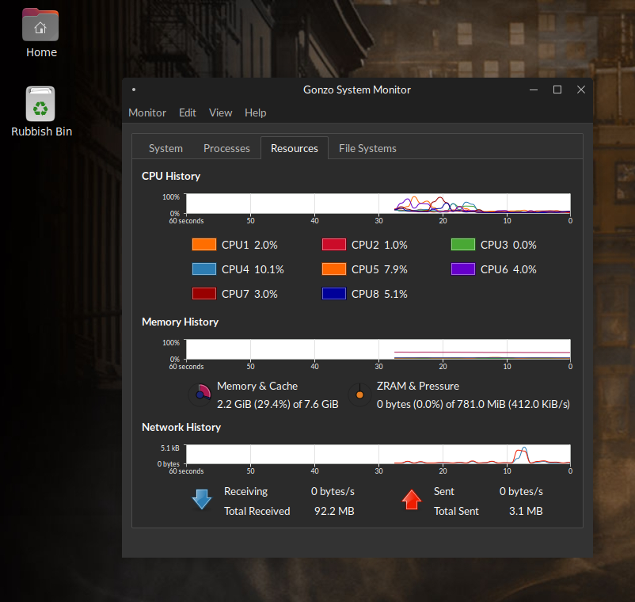

# Gonzo System Monitor

A fork of [MATE System Monitor](https://github.com/mate-desktop/mate-system-monitor)
with live integration for [detritusd](https://github.com/TTR-IND/detritusd),
a small helper daemon that sits on top of Linux's existing memory
management (PSI, `MADV_COLD`, kernel page-table coldness accounting) —
not a replacement for it.



## What's different from upstream MATE System Monitor

- **Coldness % column** in the process list — how much of a process's
  resident memory the kernel's own page-table accounting (`Referenced`
  vs. `Rss`) says hasn't been touched recently. Read on-demand from
  detritusd's status file, not a value accumulated by the GUI or by
  detritusd tracking scan history over time.
- **Memory & Cache pie** now includes a second wiper showing
  [GonzoCache](https://github.com/TTR-IND/gonzocache) page-cache
  residency (real, `mincore()`-measured, not estimated), layered on
  top of primary memory usage.
- **ZRAM & Pressure pie** — ZRAM usage as the primary wiper, PSI-based
  memory pressure rate as a second wiper, both independently
  color-configurable via a custom two-color picker dialog.
- **Live memory pressure rate** — not raw PSI stall time (which can
  legitimately sit at 0% on a healthy system doing a lot of memory
  churn), but the actual rate of `MemAvailable` change, which is what
  most people mean when they ask "how much pressure is the system
  under right now."
- Cosmetic rename only (window title, About dialog, menu entry) — the
  underlying package and binary remain `mate-system-monitor`, so this
  fork stays a drop-in replacement and doesn't fight your package
  manager.

None of this works without [detritusd](https://github.com/TTR-IND/detritusd)
running — without it, the new UI elements degrade gracefully and show
"detritus not running" rather than failing.

## Status

Developed and tested on **Devuan Excalibur, OpenRC, MATE desktop**,
built against upstream MATE System Monitor's `master` branch. It
should build on any system that can build stock MATE System Monitor —
the changes here are additive (new columns, new pie wipers, new
optional data source) rather than structural — but this has not been
verified on distributions other than Devuan.

## Install

```bash
git clone https://github.com/TTR-IND/gonzo-system-monitor.git
cd gonzo-system-monitor
sudo ./install.sh
```

This builds and installs Gonzo System Monitor to `/usr` as a drop-in
replacement for `mate-system-monitor`. It auto-detects whether
`libsystemd` is available and configures the build accordingly, so you
don't need to remember `-Dsystemd=false` yourself. Every run writes a
full log to `/var/log/gonzo-monitor-install-<timestamp>.log`.

To remove it and restore the stock package:

```bash
sudo ./install.sh --uninstall
```

### Manual build

If you'd rather not use the script:

```bash
meson setup build --prefix=/usr -Dsystemd=false
ninja -C build
sudo ninja -C build install
```

Drop `-Dsystemd=false` if you're on a systemd-based distro (this flag
only disables systemd-logind session/seat columns in the process
list — irrelevant to any of the detritus-specific features above).

You'll also want [detritusd](https://github.com/TTR-IND/detritusd)
installed and running for any of the new UI elements to show real
data.

## Why a fork, not a patch file

Earlier iterations of this project shipped a `.patch` file applied at
install time against a fresh upstream clone. In practice this needed
repeated, environment-specific fixes — missing gettext ITS rules,
GSettings schema keys that were easy to add in source but easy to
forget in the schema XML, build-option defaults that differ across
distros — each only discoverable by actually building against a real
target system. A patch file pushes that discovery process onto every
person who installs it, on every install. A maintained fork means that
work happens once, here, and anyone cloning this repo gets a tree that
already builds.

## Keeping this up to date with upstream

This repo tracks upstream as a remote:

```bash
git fetch upstream
git merge upstream/master
```

Resolve any conflicts (most will be in files this fork doesn't touch,
so conflicts should be rare), then rebuild and test before pushing.

## License

Same as upstream MATE System Monitor: GNU General Public License,
version 2. See `COPYING`.
